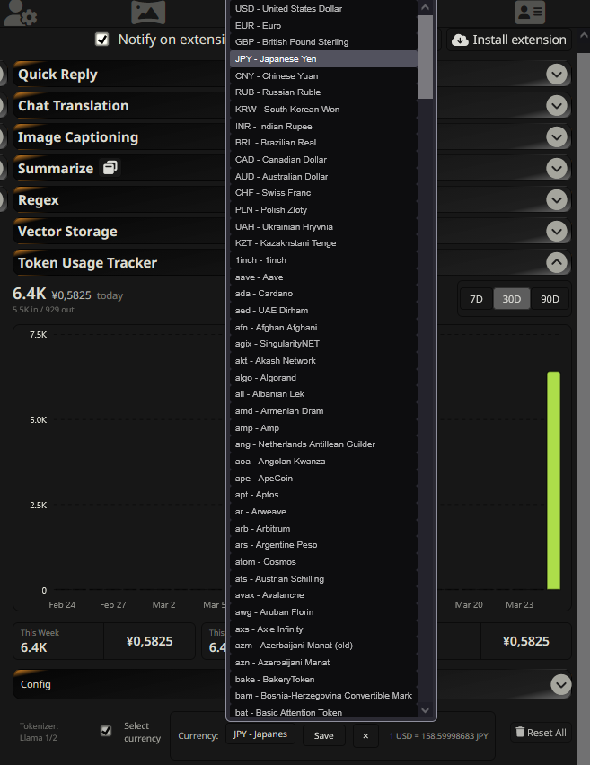
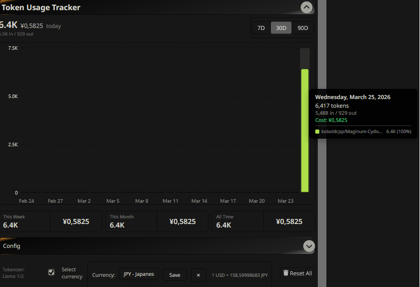

# Token Usage Tracker

A SillyTavern extension that tracks and visualizes token usage and price for your chats.

## Features

- **Token Tracking**: Automatically tracks input/output tokens for each message
- **Cost Calculation**: Set custom prices per model and see real-time cost estimates
- **Currency Conversion**: Display costs in your preferred currency (340+ currencies supported)
- **Time-based Stats**: View usage by day, week, month, or custom range
- **Model Breakdown**: See token usage and costs per AI model
- **Interactive Chart**: Visual bar chart with daily token usage breakdown

<details>
<summary>🆕 New Features (click to expand)</summary>





</details>

## Installation

1.  Open SillyTavern and navigate to the **Extensions** menu (blocks icon).
2.  Click on **Install Extension**.
3.  Paste the repository URL into the "Extension URL" field:
    ```
    https://github.com/Triedge-sys/Extension-TokenUsage
    ```
4.  Click **Install for all users** or **Install just for me**.

## Usage

Once installed, the extension will automatically start tracking token usage. The GUI will be in the extensions menu.

## Credits

This extension is a fork of the original [Extension-TokenUsage](https://github.com/Vibecoder9000/Extension-TokenUsage) by Vibecoder9000.

## License

This project is licensed under the GNU Affero General Public License v3.0 (AGPL-3.0). See the `LICENSE` file for details.